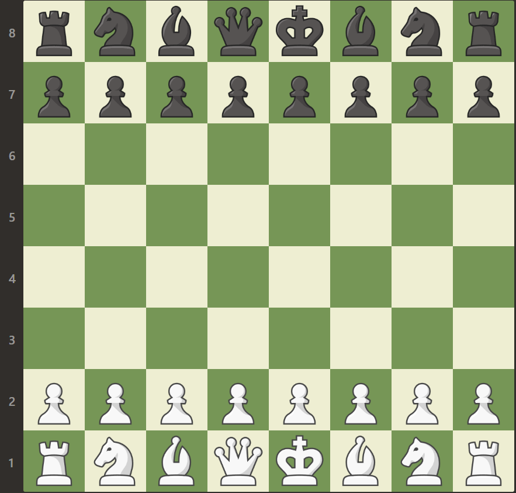

## Notation of the diffrent states
- E = Empty
- bK = black king
- wK = white king
- bQ = black queen
- wQ = white queen
- bP = black pawn
- wP = white pawn
- bR = black rook
- wR = white rook
- bN = black knight
- wN = white knight
- bB = black bishop
- wB = white bishop

## Example

This is how the standard setup of a chess game would translate:

- 8 = bR,bK,bB,bQ,bK,bB,bK,bR
- 7 = bP,bP,bP,bP,bP,bP,bP,bP
- 6 = E,E,E,E,E,E,E,E
- 5 = E,E,E,E,E,E,E,E
- 4 = E,E,E,E,E,E,E,E
- 3 = E,E,E,E,E,E,E,E
- 2 = wP,wP,wP,wP,wP,wP,wP,wP
- 1 = wR,wK,wB,wQ,wK,wB,wK,wR

Turning that into a single string the result would look like this:

'8.bR,bK,bB,bQ,bK,bB,bK,bR,7.bP,bP,bP,bP,bP,bP,bP,bP,6.E,E,E,E,E,E,E,E,5.E,E,E,E,E,E,E,E,4.E,E,E,E,E,E,E,E,3.E,E,E,E,E,E,E,E,2.wP,wP,wP,wP,wP,wP,wP,wP,1.wR,wK,wB,wQ,wK,wB,wK,wR'
 

- There are no free spaces inbetween, just a comma ,
- After every line-number is a dot .

This string is your chessboard setup.